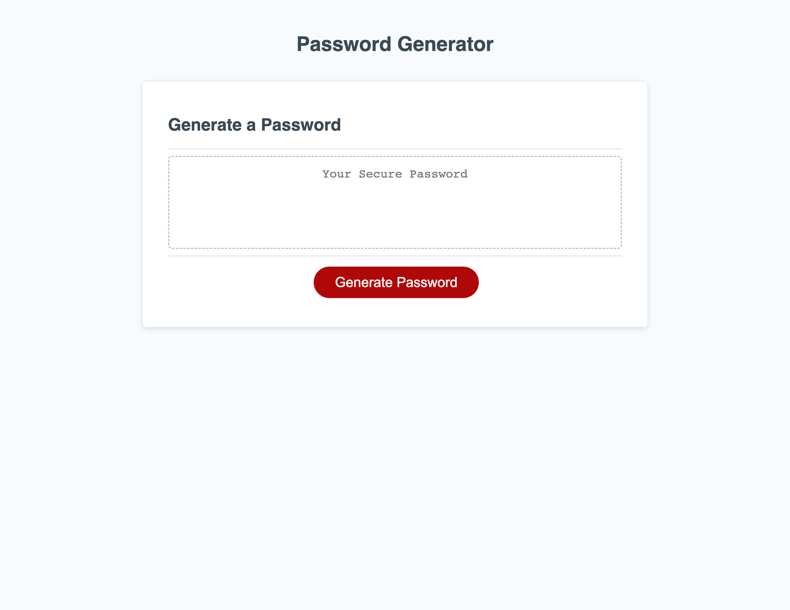

# Password-Generator

## Description
In this assignment we were asked to create the JavaScript logic to generate a password. Not just any password though. We want to generate a password that allows the user to select if they want to include "uppercase letters", "lowercase letters", "special characters", or "numbers". We want to prompt the user when they click the button. The prompt will ask the user how many characters they want their password to be. Then confirm with the user which type of characters they will include in the generation. 

## Installation
N/A

## Usage
https://travis3214.github.io/Password-Generator/

## License
N/A

## Screenshot
